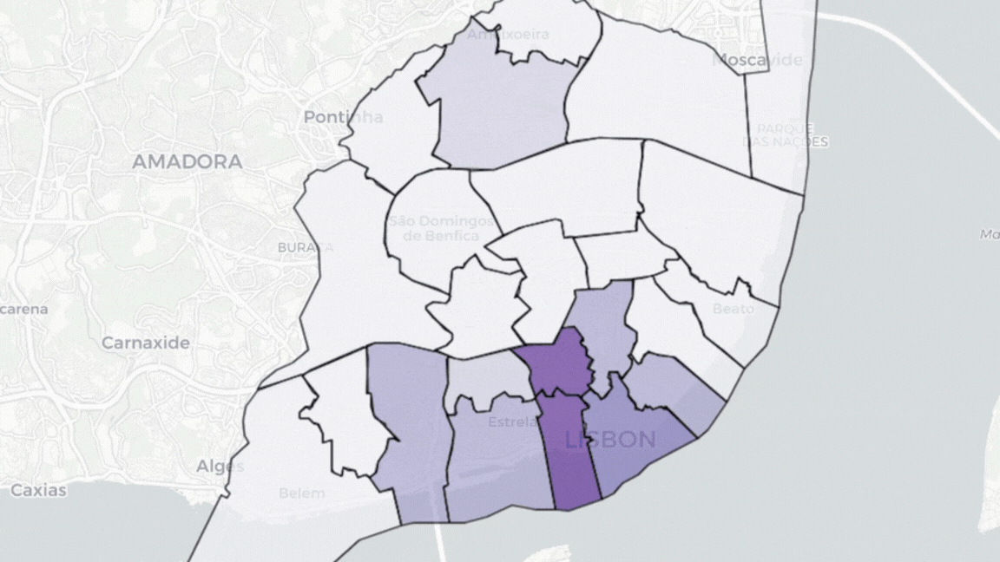

# Web Scraping, Geolocalização e Mapas Iterativos com Python

  

Este projeto foi desenvolvido a partir de coleta de dados dinâmicos, geocodificação e visualização espacial com mapas interativos utilizando dados de Lisboa, Portugal.
## Web Scraping
Ferramenta: `Selenium` e `WebDriver Manager`.
Objetivo: Coleta de dados de localidades. Optou-se pelo Selenium em vez da biblioteca Requests devido à necessidade de lidar com conteúdos e elementos dinâmicos das páginas testadas.

## Geolocalização
Ferramenta: `GeoPy`
Objetivo: Manipulação de dados com Pandas para ler arquivos CSV, realizar consultas automáticas de coordenadas (latitude e longitude) e enriquecer a base de dados original com as novas colunas geográficas.

## Plotagem e Criação de Mapas

Ferramenta: `Folium`, `GeoPandas` e `Branca`.
Objetivo: 
- Uso de arquivos GeoJSON externos para delimitar e renderizar os limites das freguesias de Lisboa.
- Integração de plugins como HeatMap (Mapas de Calor), Geocoder (barra de pesquisa no mapa) e LayerControl para alternância de camadas.
Uso secundário de `Matplotlib` e `Seaborn` para análises exploratórias.
